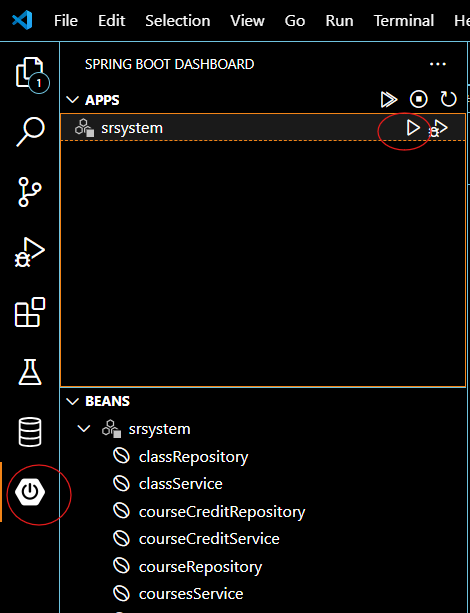

# STUDENT REGISTRATION SYSTEM

## Team Members.
1.Sanket Dalvi

2.Alisha Bingewar

3.Animesh Patil

4.Ganesh Naik

    we worked in below phases:

	* Requirement gathering and understanding phase.
	* Analysis and work distribution.
	* Development phase.
	* Testing phase.
	* Bug fixing phase.
	* Presentation phase.

## Features:

- Automated Enrollment Process: Simplifies and accelerates student registration by automating the enrollment process, reducing manual effort and streamlining administrative tasks.

- Course Management: Enables administrators to efficiently manage courses, including adding, updating, and setting prerequisites, ensuring effective course organization and planning.

- User Authentication and Authorization: Ensures secure access to system functionalities by implementing robust user authentication and authorization mechanisms, safeguarding sensitive information from unauthorized access.

- Dynamic Web Interface: Provides users with a dynamic and interactive web interface, utilizing JSPs and Java Servlets, enhancing user experience and facilitating intuitive navigation.

- Data Integrity and Redundancy Minimization: Maintains data integrity and minimizes redundancy within the database through normalization principles and PL/SQL procedures and triggers, ensuring accuracy and efficiency in data management.

## Setpup:

- Need to instal java 17 in your system

  * Download link (https://www.oracle.com/java/technologies/downloads/#java17)
  * java manual setup (https://www.java.com/en/download/help/windows_manual_download.html)
  
- Set path in environment varibale as below

- Download below extension in VS code Studio

# Set Oracle account password in application.properties

## Outline of Backend PL-SQL Code

* **DB Package Name** - srsystem

* All functions to display tables

	- FUNCTION get_students_cursor RETURN ref_cursor;
    - FUNCTION get_courses_cursor RETURN ref_cursor;
    - FUNCTION get_prerequisites_cursor RETURN ref_cursor;
    - FUNCTION get_course_credit_cursor RETURN ref_cursor;
    - FUNCTION get_classes_cursor RETURN ref_cursor;
    - FUNCTION get_score_grade_cursor RETURN ref_cursor;
    - FUNCTION get_g_enrollments_cursor RETURN ref_cursor;
    - FUNCTION get_logs_cursor RETURN ref_cursor;
    - FUNCTION get_srsuser_cursor RETURN ref_cursor;

* All procedures created
	- PROCEDURE get_students_by_class_id
	- PROCEDURE get_prerequisites_by_course
	- PROCEDURE enroll_graduate_student
	- PROCEDURE drop_graduate_student
	- PROCEDURE delete_student

* All trigger created
    
	- student_deletion_trigger
	- enrollment_trigger
	- drop_trigger
	- delete_g_enrollments
    - student_insert_trigger
    - class_insert_trigger
    - class_delete_trigger
    - course_delete_trigger
    - course_insert_trigger
    - deleteclass_g_enrollments

## Outline of Frontend and Java Code

## Run application

-Goto springboot dashboard and click on Run

Access the application at http://localhost:8080/

## Usage

- Home page

- Login Page

- Signup page

- View students table

- Add into student table

- View courses Table

-Add courses

- View classes table

-Add into classes

-View course credit

- view score grade

-view grad enrollment

-View Prereuisite

-Search Prerequisite

-Enroll and drop grad student

-View logs table

## Technologies Used

Certainly! Here's the list of technologies used in SearchLite in the requested format:

- **Java**
- **Oracle database**
- **thymleaf engine**
- **Frontend**: HTML, CSS, JavaScript
- **Backend**: springboot (Django framework)

## Contributors

- [Alisha Bingewar](https://github.com/abingewar)
- [Animesh Patil](https://github.com/apatil2332)